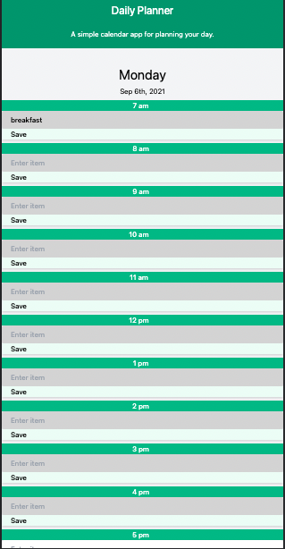
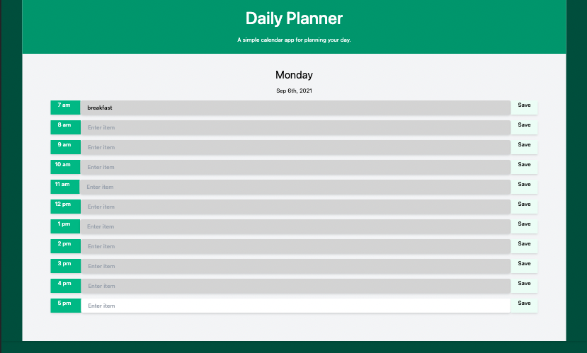

# Day Planner application

### Description
Basic application to schedule tasks throughout the day

### Features
* Enter tasks at various times
* Saves tasks to browser local Storage 
* Colors of tasks change based on time of the day (gray for past, white present hour, green future)

### Deployment
This can be cloned using git and then run retaining the directory structure with the web server of your choice.

### Deployed Example
<https://philipbrowning.github.io/dayplanner/>

### Screenshots

* Mobile version

* Desktop version

### License
The code is available under the [MIT license](https://github.com/h5bp/html5-boilerplate/blob/master/LICENSE.txt).